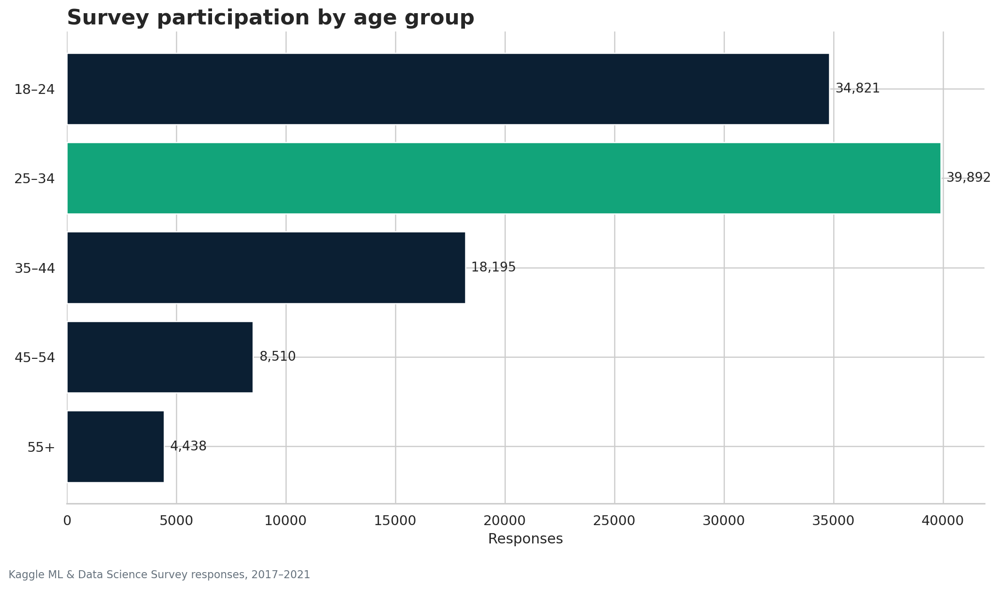
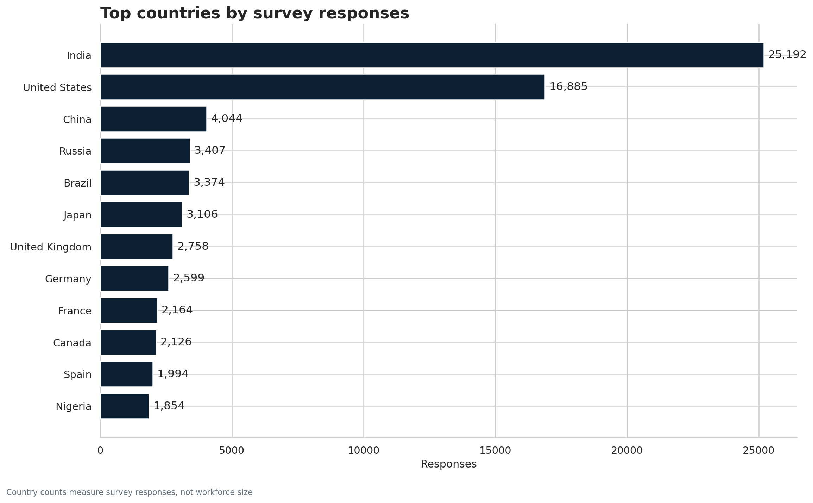
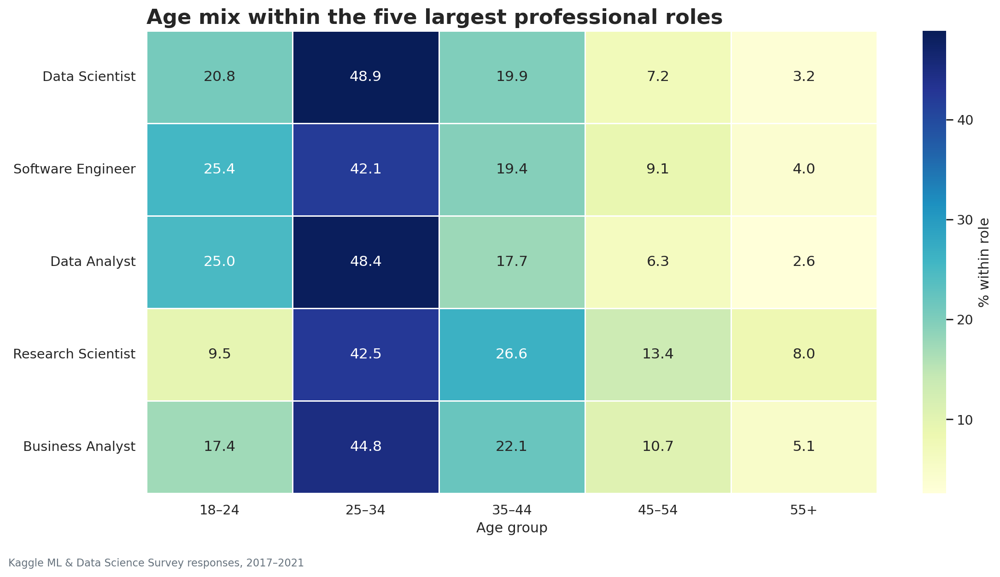
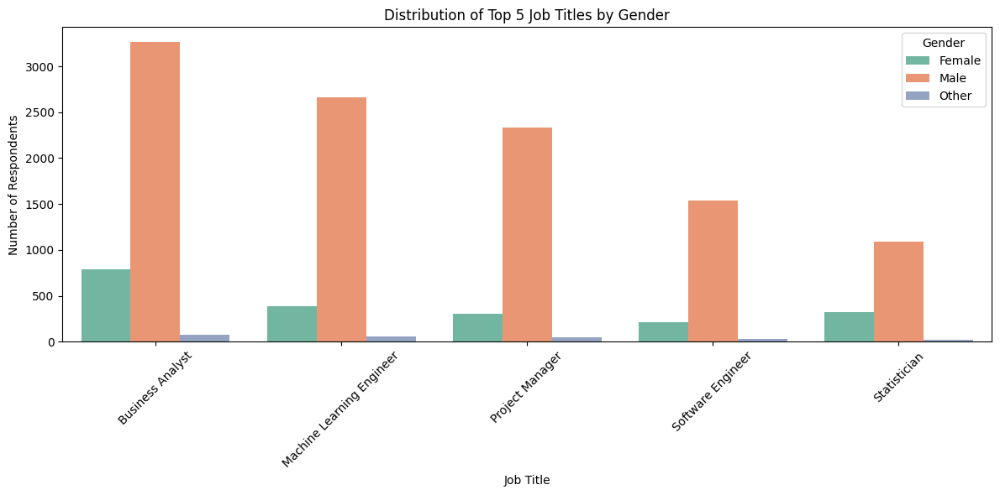
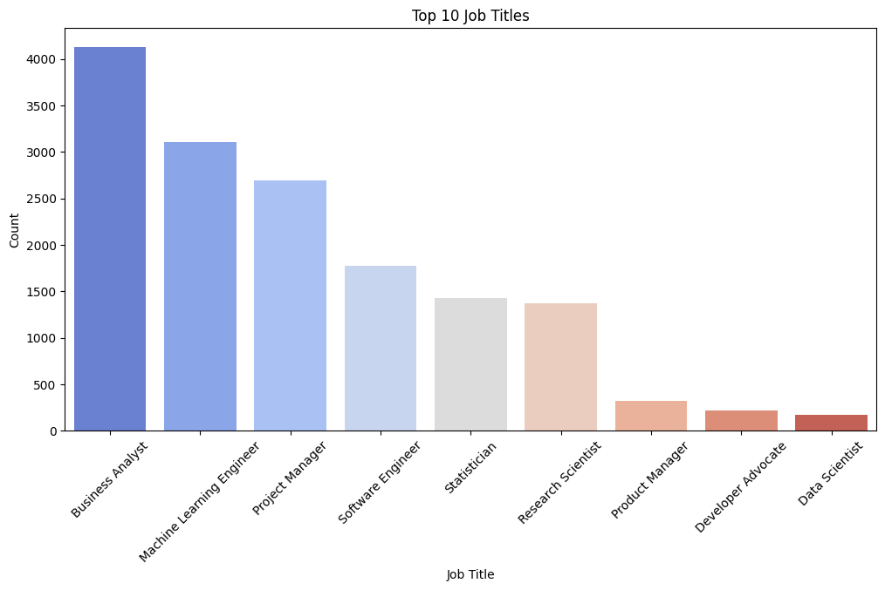
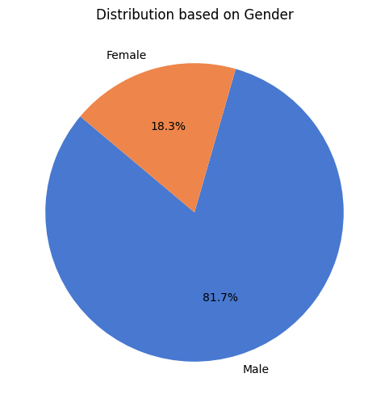
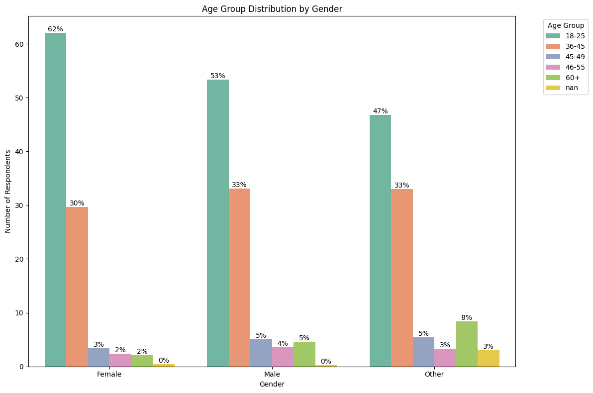

# Global Data Science Survey Analysis 2017–2021

## Project Overview

<p align="justify">
This project analyzes Kaggle’s annual Machine Learning & Data Science Survey data from <b>2017 to 2021</b> to explore global trends in the data science community. The analysis focuses on respondent demographics, job titles, programming language preferences, gender representation, education, experience, salary patterns, and geographic participation.
</p>

<p align="justify">
The objective of this project is to transform multi-year survey data into clear, meaningful insights that can support career planning, education strategy, workforce development, and inclusion initiatives in the data science and analytics field.
</p>

---

## Dataset

The project uses Kaggle survey data covering responses from data professionals, students, researchers, engineers, analysts, and other participants across different countries and experience levels.

Dataset file included in this repository:

```text
kaggle_survey_2017_2021.zip
```

> Note: Survey questions and answer formats may differ across years. The analysis focuses on selected comparable fields and standardized indicators where possible.

---

## Key Analytical Questions

This project was designed to answer questions such as:

* Which age groups are most represented in the data science community?
* Which countries have the highest number of survey respondents?
* What are the most common job titles in the data science field?
* How are job titles distributed across different age groups?
* What gender representation patterns exist across top job roles?
* How does gender distribution vary across age groups?
* What insights can support education, inclusion, and career development in data science?

---

## Tools & Technologies

* Python
* Pandas
* NumPy
* Matplotlib
* Seaborn
* Jupyter Notebook
* Data Cleaning
* Exploratory Data Analysis
* Survey Data Analysis
* Data Visualization

---

## Analysis Workflow

The project followed a structured data analysis workflow:

1. Loaded and inspected multi-year Kaggle survey data
2. Cleaned and prepared relevant columns for analysis
3. Standardized selected demographic and professional variables
4. Analyzed respondent distribution by age, gender, country, and job title
5. Created visualizations to identify patterns and trends
6. Interpreted findings and summarized key insights
7. Developed recommendations related to skills, inclusion, and career development

---

## Visual Insights

### Age Group Distribution



### Top Countries by Number of Respondents



### Age Group Distribution by Job Title



### Gender Distribution by Job Title



### Top Job Titles



### Gender Distribution



### Age Group Distribution by Gender



---

## Key Findings

### 1. Young professionals dominate survey participation

<p align="justify">
The largest group of respondents falls within the <b>18–25</b> age range, followed by the <b>36–45</b> group. This indicates strong participation from students, early-career professionals, and young data practitioners entering the data science field.
</p>

---

### 2. India and the United States lead global participation

<p align="justify">
India and the United States represent the highest number of respondents, showing their strong presence in the global data science and analytics community. Other countries such as China, Russia, Brazil, Japan, the United Kingdom, Germany, France, and Canada also show meaningful participation.
</p>

---

### 3. Business Analyst, Machine Learning Engineer, and Project Manager are among the top roles

<p align="justify">
The analysis shows that Business Analyst, Machine Learning Engineer, Project Manager, Software Engineer, Statistician, and Research Scientist are among the most common job titles in the dataset. This reflects the wide range of professional backgrounds contributing to the data science ecosystem.
</p>

---

### 4. Gender imbalance remains visible across top roles

<p align="justify">
The gender distribution analysis shows a clear imbalance, with male respondents representing a significantly larger share of the survey population compared to female respondents. This gap is also visible across several top job titles, including Business Analyst, Machine Learning Engineer, Project Manager, Software Engineer, and Statistician.
</p>

---

### 5. Age and role distribution reveal different career patterns

<p align="justify">
The age distribution by job title suggests that some roles attract younger respondents, while others show stronger representation from mid-career professionals. Roles such as Machine Learning Engineer and Business Analyst show strong participation across younger and mid-career age groups.
</p>

---

## Insights Summary

* The data science community has strong participation from young professionals and students.
* India and the United States are the leading countries by respondent count.
* Business Analyst, Machine Learning Engineer, and Project Manager are among the most common roles.
* Gender imbalance remains a major issue across the data science workforce.
* Age distribution varies significantly by job title.
* Survey analysis can help identify global workforce trends, inclusion gaps, and career development opportunities.

---

## Recommendations

Based on the analysis, the following recommendations are suggested:

* Strengthen Python and data analysis training for students and early-career professionals.
* Support career development programs for emerging data professionals in high-participation countries.
* Promote inclusion initiatives to improve female participation in data science roles.
* Encourage mentorship programs for underrepresented groups in analytics, AI, and machine learning.
* Use survey insights to guide education providers, bootcamps, and workforce development programs.
* Expand remote and international opportunities to connect talent from emerging markets with global employers.

---

## Project Outcome

<p align="justify">
This project demonstrates the use of Python for real-world survey data analysis. It applies data cleaning, exploratory data analysis, and visualization techniques to uncover patterns in global data science participation, demographics, professional roles, and workforce representation.
</p>

The project highlights practical skills in:

* Python data analysis
* Survey data cleaning
* Exploratory data analysis
* Data visualization
* Demographic analysis
* Workforce trend analysis
* Insight generation and reporting

---

## Repository Structure

```text
Data-science-survey-analysis/
│
├── README.md
├── Survey_Project.ipynb
├── kaggle_survey_2017_2021.zip
│
└── images/
    ├── age-group-distribution.png
    ├── top-countries-by-respondents.png
    ├── age-group-by-job-title.png
    ├── gender-distribution-by-job-title.png
    ├── top-job-titles.png
    ├── gender-distribution.png
    └── age-group-by-gender.png
```

---

## How to Use This Project

1. Clone the repository:

```bash
git clone https://github.com/Yasir101-hi/Data-science-survey-analysis.git
```

2. Open the project folder.

3. Extract the dataset file:

```text
kaggle_survey_2017_2021.zip
```

4. Open the notebook:

```text
Survey_Project.ipynb
```

5. Run the notebook cells to reproduce the analysis and visualizations.

---

## Author

**Yasir Awad**
Data Analyst | Business Intelligence | Energy & Operations Analytics

* LinkedIn: https://www.linkedin.com/in/yasirawad
* GitHub: https://github.com/Yasir101-hi
* Email: [yasir.petro.analytics@outlook.com](mailto:yasir.petro.analytics@outlook.com)

---

## Project Status

Completed. Future improvements may include adding more advanced salary analysis, regional comparisons, interactive dashboards, and additional year-by-year trend analysis.
