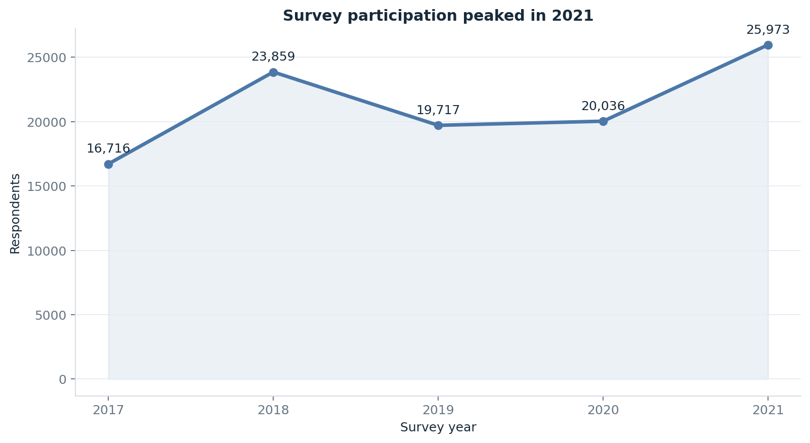
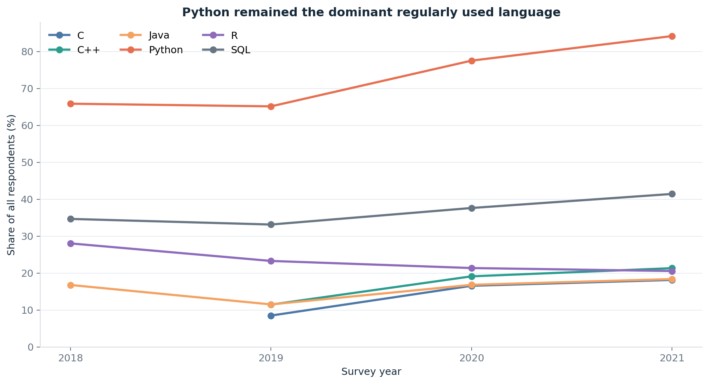
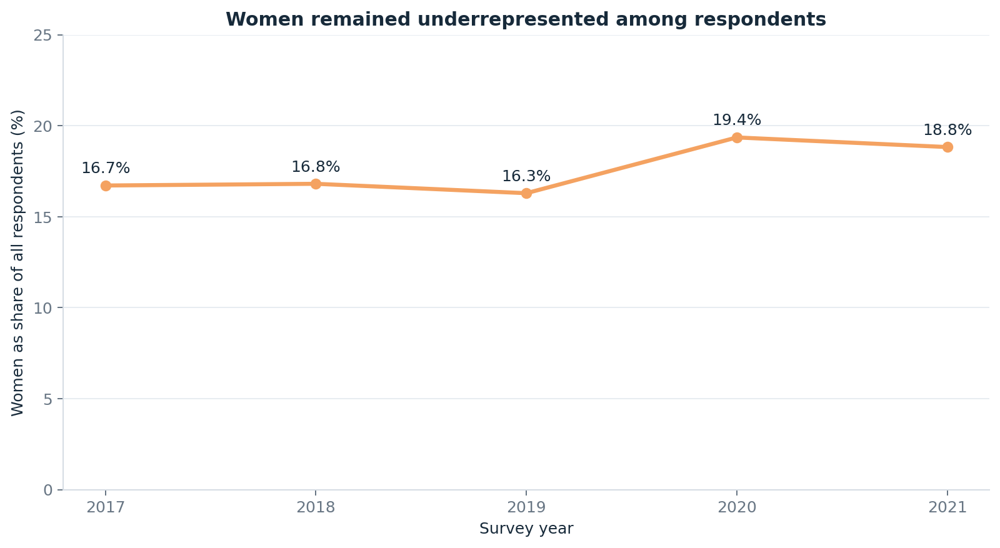
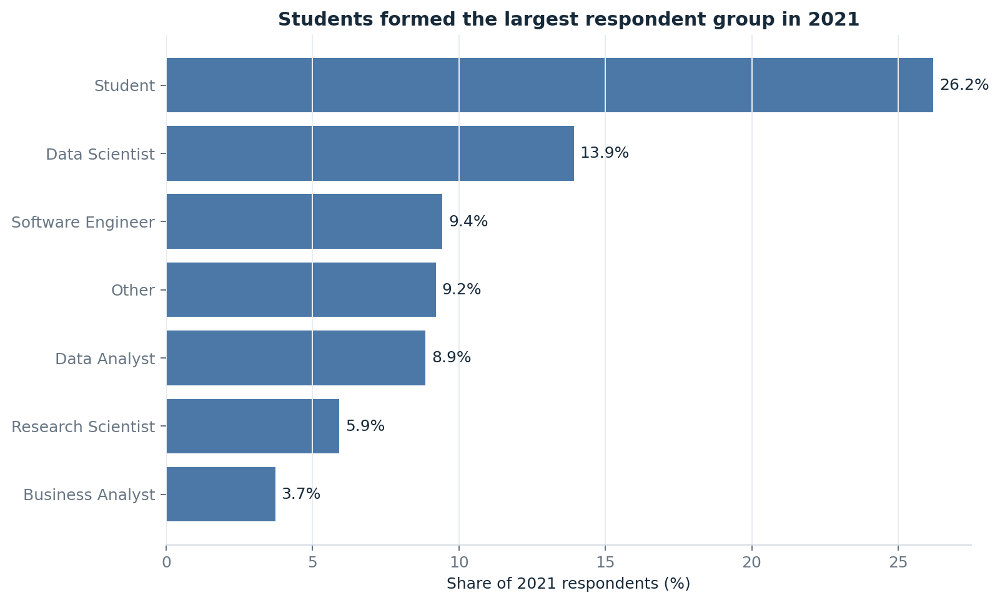
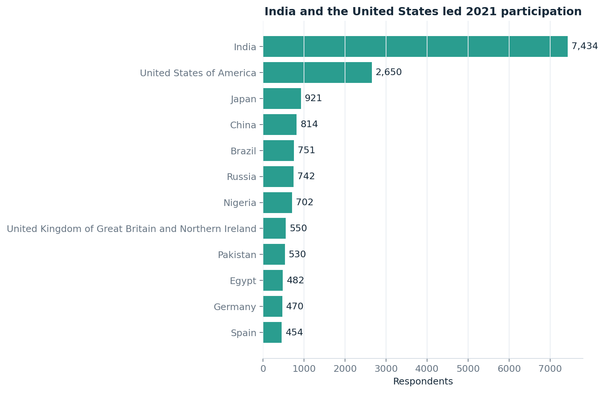

# Global Data Science Survey Analysis | 2017–2021

A reproducible Python analysis of **106,301 Kaggle survey responses** across five annual Machine Learning & Data Science Survey editions, focused on participation trends, age, gender, geography, professional roles, education, and programming-language preferences.



**[Download the five-page analytical report](docs/kaggle-data-science-survey-trends-report.pdf)**

## Executive Snapshot

| KPI | Verified result |
|---|---:|
| Survey editions | **5** |
| Total responses | **106,301** |
| Response growth, 2017 to 2021 | **55.4%** |
| Largest age group | **25–34: 39,892 (37.5%)** |
| Largest country contribution | **India: 25,192 (23.7%)** |
| Largest non-student professional role | **Data Scientist: 17,128** |
| Women among 2021 respondents | **18.8%** |
| Python regular use in 2021 | **84.2%** |
| Python recommended first | **66,892 responses** |
| Python regular-use selections | **65,942** |
| SQL regular-use selections | **33,090** |

> Counts across years represent survey responses, not necessarily unique individuals. The survey is voluntary and should not be treated as a census of the global data workforce.

## Analytical Problem

Multi-year survey analysis is difficult because question wording, answer labels, available fields, and respondent composition change between editions. This project addresses:

- Which age groups and countries contributed the most responses?
- Which professional roles appear most frequently?
- Which languages are used and recommended most often?
- How does participation differ by gender and geography?
- What can be compared across years without overstating the evidence?
- Which conclusions require more controlled analysis?

## Dataset Scope

| Year | Responses |
|---|---:|
| 2017 | 16,716 |
| 2018 | 23,859 |
| 2019 | 19,717 |
| 2020 | 20,036 |
| 2021 | 25,973 |
| **Total** | **106,301** |

The source archive is included as `kaggle_survey_2017_2021.zip`. Both notebooks load the CSV directly from the ZIP and remove the embedded question-label row.

Source: [Kaggle Data Science Survey 2017–2021 merged dataset](https://www.kaggle.com/datasets/andradaolteanu/kaggle-data-science-survey-20172021).

## Reproducible Workflow

1. Load the source ZIP using a repository-relative path.
2. Remove the survey-question label row.
3. Standardize comparable gender and country labels.
4. Harmonize age bands correctly.
5. Consolidate only clear job-title synonyms while preserving unmatched roles.
6. Count multiple-selection language fields correctly.
7. Build demographic, geographic, role, and language visualizations.
8. Build year-aware participation, language, role, and representation trend tables.
9. Apply explicit interpretation boundaries to salary and participation results.

The project now contains two complementary notebooks with cleared outputs:

- [Demographic and workforce analysis](Survey_Project.ipynb)
- [Year-over-year trend analysis](Survey_Trends_2017_2021.ipynb)

Both notebooks can be rerun against the published archive.

## Verified Findings

### Year-over-year trends

- Participation increased from **16,716 responses in 2017** to **25,973 in 2021**, a net increase of **55.4%**.
- Participation peaked in 2021 after a decline in 2019 and a modest recovery in 2020.
- Python was selected for regular use by **84.2% of 2021 respondents**. Regular-use multi-select fields are unavailable for 2017, so this trend begins in 2018.
- Women represented **16.6% of respondents in 2017** and **18.8% in 2021**, with a peak of **19.4% in 2020**.
- Students were the largest 2021 role group at **26.2%**.

### Age participation

- **25–34** was the largest harmonized age group with **39,892 responses (37.5%)**.
- **18–24** followed with **34,821 responses (32.8%)**.
- Together, these groups accounted for most recorded participation, but this reflects the survey sample—not necessarily the global workforce.

### Geography

- India contributed **25,192 responses (23.7%)**.
- The United States contributed **16,885 responses (15.9%)**.
- China, Russia, Brazil, and Japan were the next largest named country groups.
- Country comparisons measure survey participation and should not be interpreted as national workforce size.

### Professional roles

After preserving original values and consolidating only clear synonyms:

| Role | Responses |
|---|---:|
| Student | 21,242 |
| Data Scientist | 17,128 |
| Software Engineer | 12,473 |
| Data Analyst | 8,509 |
| Research Scientist | 6,968 |
| Business Analyst | 4,112 |
| Machine Learning Engineer | 3,198 |

**Data Scientist**, not Business Analyst, was the largest professional role in the corrected analysis.

### Programming languages

- Python was recommended first in **66,892 responses**.
- Regular-use selections included **65,942 for Python**, **33,090 for SQL**, and **20,884 for R**.
- Regular-use questions allow multiple selections, so these counts do not add to the number of respondents.

### Gender participation

- Among respondents selecting the harmonized binary categories, **82.0% were men** and **18.0% women**.
- Other gender identities and disclosure preferences remain part of the source data but are excluded from this particular two-category percentage.
- This finding describes survey participation, not the gender composition of the entire data profession.

### Defined Arab-country subset

For the explicitly selected countries Egypt, Morocco, Tunisia, Saudi Arabia, United Arab Emirates, Algeria, and Iraq:

- The subset contained **2,292 responses**.
- Egypt led with **945**.
- Women represented **26.4%** of binary gender responses.
- Students represented **497 responses (21.7%)**.

This seven-country subset is not a complete representation of the Arab world.

## Visual Insights

### Participation by Year


### Programming-Language Trends



### Women’s Representation



### 2021 Role Mix



### Top 2021 Countries



### Age Group Distribution


### Top Countries


### Age by Professional Role


### Gender by Professional Role


### Top Roles


### Gender Participation


### Age by Gender


## Interpretation and Recommendations

1. Use Python and SQL as broad foundational skills, then specialize by target role.
2. Report annual denominators when discussing trends across survey editions.
3. Preserve original categories and document every harmonization rule.
4. Treat participation gaps as signals for further study, not population estimates.
5. Separate students and employed respondents in career and compensation analysis.
6. Adjust salary comparisons for country, role, experience, education, and year before making pay-equity claims.
7. Avoid causal conclusions from descriptive survey data.

## Documentation

- [Verified KPI reference](docs/kpi-reference.md)
- [Survey harmonization methodology](docs/methodology.md)
- [Trend-analysis methodology and limitations](docs/methodology-and-limitations.md)
- [Data-quality report](docs/data-quality-report.md)
- [Five-page PDF report](docs/kaggle-data-science-survey-trends-report.pdf)

These documents explain calculations, corrections, survey limitations, and reproducibility decisions.

## Tools and Skills Demonstrated

- Python and Pandas
- NumPy
- Matplotlib and Seaborn
- Jupyter Notebook
- Multi-year survey harmonization
- Data cleaning and validation
- Exploratory data analysis
- Demographic and workforce analysis
- Evidence-based reporting

## Repository Structure

```text
global-data-science-survey-analysis/
├── README.md
├── Survey_Project.ipynb
├── Survey_Trends_2017_2021.ipynb
├── kaggle_survey_2017_2021.zip
├── requirements.txt
├── data/
│   └── processed/
│       ├── respondents_core.csv
│       ├── language_usage_by_year.csv
│       └── survey_summary_by_year.csv
├── docs/
│   ├── kpi-reference.md
│   ├── methodology.md
│   ├── methodology-and-limitations.md
│   ├── data-quality-report.md
│   └── kaggle-data-science-survey-trends-report.pdf
└── images/
    ├── respondents_by_year.png
    ├── language_usage_trends.png
    ├── women_representation_trend.png
    ├── role_mix_2021.png
    ├── top_countries_2021.png
    ├── age-group-distribution.png
    ├── top-countries-by-respondents.png
    ├── age-group-by-job-title.png
    ├── gender-distribution-by-job-title.png
    ├── top-job-titles.png
    ├── gender-distribution.png
    └── age-group-by-gender.png
```

## How to Run

1. Clone the repository.
2. Install the dependencies with `python -m pip install -r requirements.txt`.
3. Start Jupyter from the repository root.
4. Open either `Survey_Project.ipynb` or `Survey_Trends_2017_2021.ipynb`.
5. Run all cells; both notebooks read the CSV directly from the included ZIP archive.

## Validation Note

All exact values in this README were recomputed from the published combined CSV after removing the embedded question row. Salary midpoint outputs remain descriptive estimates and are not presented as causal evidence.

## Author

**Yasir Awad**  
Data Analyst | Business Intelligence | Energy & Operations Analytics

- [GitHub](https://github.com/Yasir101-hi)
- [LinkedIn](https://www.linkedin.com/in/yasirawad)
- Email: [yasir.petro.analytics@outlook.com](mailto:yasir.petro.analytics@outlook.com)

## Project Status

Completed and reproducible. The repository includes demographic analysis, year-specific trends, processed summaries, portfolio-ready charts, and a validated PDF report. A controlled compensation model remains a possible future extension.
